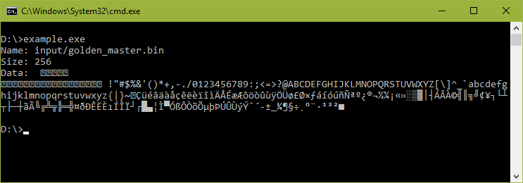

# bin2cpp
Generates C++11 source code which embed several external (binary) files.

## Features
 - can wrap the generated code into a namespace
 - can iterate (recursively) over the files of a given folder
 - name of the original input file is also embedded with its data
 - provides a C++11 interface compatible with range-based `for` loops  

## License
 - This is free and unencumbered software released into the **public domain**.
 - Anyone is free to copy, modify, publish, use, compile, sell, or distribute this software, either in source code form or as a compiled binary, for any purpose, commercial or non-commercial, and by any means.
 - For more information, please refer to [http://unlicense.org/]()

## Supported options

```
bin2cpp: generates C++11 source code which embed several external (binary) files.
Supported options:
 <input>    : path to an input file or directory to embed in C++ code.
              If it's a directory, its content will be recursively iterated.
              Note: several inputs can be passed on the command line.
 -h         : this help message.
 -ns <name> : name of the namespace to be used in generated code (recommended).
              Default is empty (no namespace).
 -o <name>  : base name to be used for the generated .h/.cpp files.
              => '-o generated' will produce 'generated.h' and 'generated.cpp' files.
              Default value is 'bin2cpp'.
```
 
## Example

### Invocation

```
D:\test>dir files /b
golden_master.bin

D:\test>bin2cpp -ns myNS -o generated files/
Ready to process 1 file(s).
Generating generated.h...
Generating generated.cpp...
  files/golden_master.bin

D:\test>dir /b
generated.cpp
generated.h
```

### Importing and using the generated code

```cpp
#include "generated.h"
#include <iostream>

int main() {
    for (auto file : myNS::fileList()) {
        std::cout << "Name: " << file.name() << "\n";
        // content() returns a "const std::string &" to a static object
        // that is created once only if requested 
        std::cout << "Size: " << file.content().size() << "\n";
        std::cout << "Data: " << file.content() << "\n";
    }
}
```


## Generated code

### generated.h

```cpp
#pragma once

#include <string>

namespace myNS {
	struct FileInfo {
		const char * fileName;
		const char * fileData;
		const unsigned int fileDataSize;

		std::string name() const {
			return fileName;
		}

		const std::string & content() const {
			static const std::string data{ fileData, fileDataSize };
			return data;
		}
	};

	extern const unsigned int fileInfoListSize;
	extern const FileInfo fileInfoList[];

	struct FileInfoRange {
		const FileInfo * begin() const {
			return &fileInfoList[0];
		}
		const FileInfo * end() const {
			return begin() + size();
		}
        const size_t size() const {
            return fileInfoListSize;
        }
	};

	inline FileInfoRange fileList() {
		return FileInfoRange{};
	}
}

```

### generated.cpp

```cpp
#include "generated.h"

namespace /* anonymous */ {
	const char * file0_name = "files/golden_master.bin";
	const unsigned int file0_data_size = 256;
	const unsigned char file0_data[file0_data_size] = {
		0x0,0x1,0x2,0x3,0x4,
		// ...
		0xff,
	};
}

namespace myNS {
	const unsigned int fileInfoListSize = 1;
	const FileInfo fileInfoList[fileInfoListSize] = {
		{ file0_name, reinterpret_cast<const char*>(file0_data), file0_data_size },
	};
}
```
## Building the source

There's just a single ```main.cpp``` file that depends on ```filesystem``` library.

### Supported compilers
 - Visual C++ 2015
